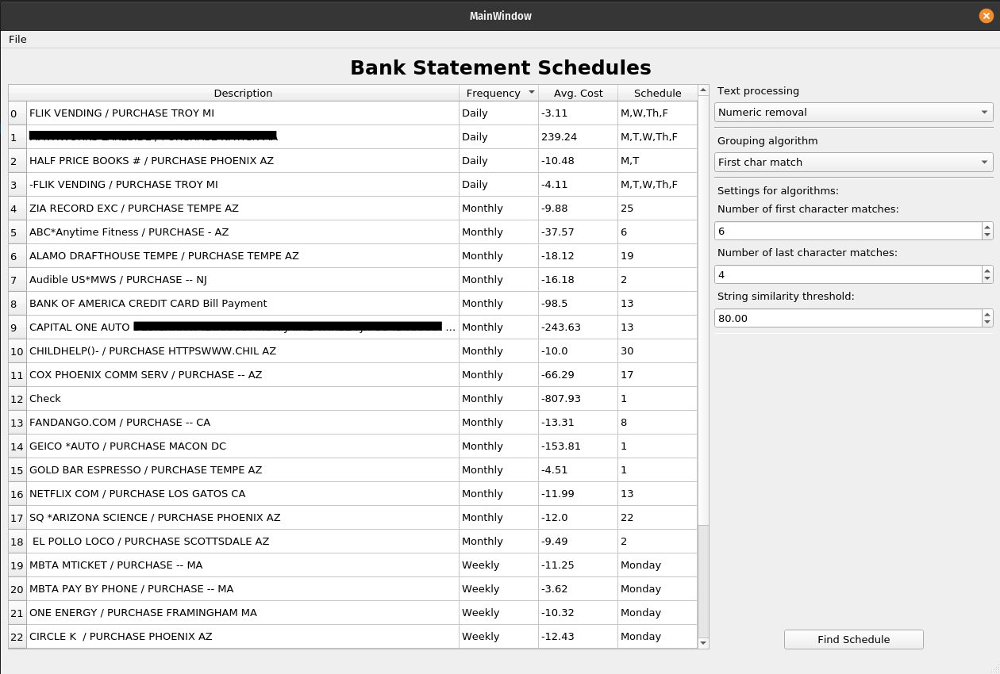

# boaAnalysisTool
A simple gui tool to practice pyqt and pandas as well as analyze a BOA bank statement and current subscriptions.

At some point I want to add anomaly detection as well.

# Query view

Allows you to load your bank statement files and perform regex queries:

# How subscriptions are determined.

The program examines the description fields and groups the expenses according to pre-described algorithms (n-char match, number removal, etc.).  For each group the following is done:

1.) Determine if the signal is scheduled.  If not, exit
2.) Determine the periodicity of the signal (weekly, monthly, daily, etc.)
3.) populate the periodic signal container (this is what is displayed on the table)

A user can change the settings of the grouping algorithms in the right side panel.

# Libraries in use

1.) pandas

2.) numpy

3.) scipy

4.) levenstein

